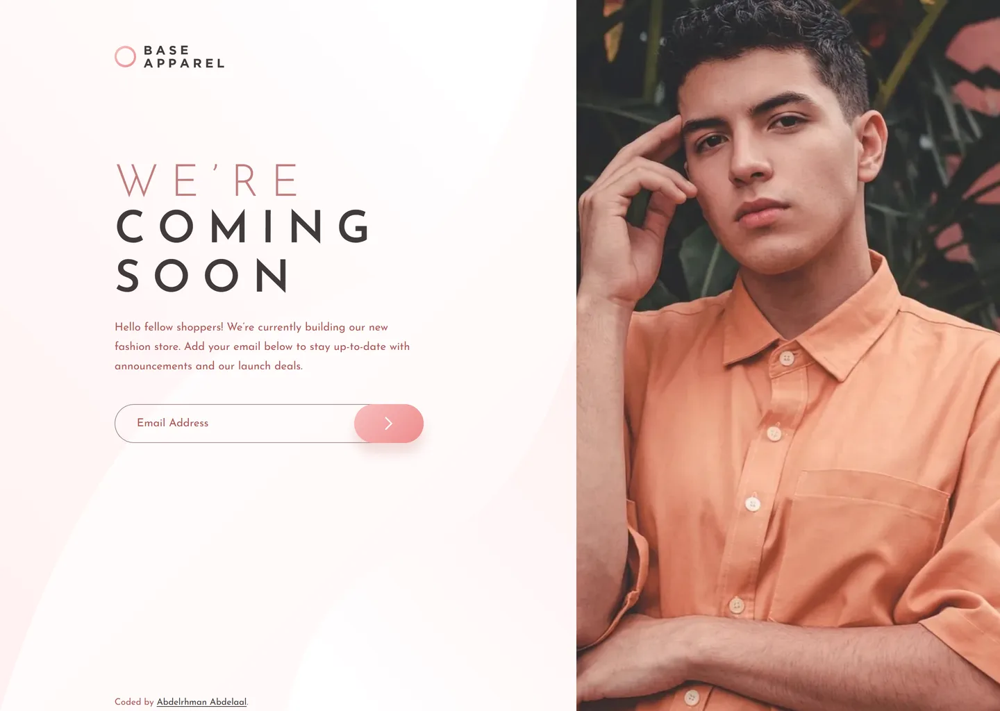

# Frontend Mentor - Base Apparel coming soon page solution

This is a solution to the [Base Apparel coming soon page challenge on Frontend Mentor](https://www.frontendmentor.io/challenges/base-apparel-coming-soon-page-5d46b47f8db8a7063f9331a0). Frontend Mentor challenges help you improve your coding skills by building realistic projects.

## Table of contents

- [Overview](#overview)
  - [Screenshot](#screenshot)
  - [Links](#links)
- [My process](#my-process)
  - [Built with](#built-with)
  - [Design deviations](#design-deviations)
- [Author](#author)

## Overview

### Screenshot

### Links

- Solution URL: [GitHub](https://github.com/MrBlackvanta/base-apparel-coming-soon)
- Live Site URL: [Cloudflare](https://base-apparel-coming-soon.abdelrhman-ahmed8881.workers.dev)

## My process

### Built with

- [Next.js 16](https://nextjs.org/) (App Router, React Compiler, Turbopack)
- [React 19](https://react.dev/)
- [TypeScript](https://www.typescriptlang.org/) (strict)
- [Tailwind CSS v4](https://tailwindcss.com/)

### Design deviations

**Four colours change, to reach 100 on Lighthouse accessibility.** Every ratio below is
measured against the backdrop the text actually sits on — the page gradient's dark end,
`#FFF4F4` — and solved on the rounded 8-bit channels the browser paints, not on floats.

|                             | design    | contrast | shipped   | contrast |
| --------------------------- | --------- | -------- | --------- | -------- |
| "WE'RE" (64px / 40px)       | `#CE9898` | 2.28     | `#C17D7D` | 3.00     |
| Paragraph, placeholder      | `#CE9898` | 2.28     | `#AF5757` | 4.51     |
| Error border, icon, message | `#F96464` | 2.77     | `#CE3B43` | 4.50     |
| Input border                | `#E6CCCC` | 1.41     | `#A38989` | 3.00     |

The two pinks keep the original's hue and saturation exactly — both are `hsl(0 36% …)` —
and differ only in lightness: 62.5% for the heading, which needs 3:1 as large text, and
51.5% for body copy, which needs 4.5:1. Reading as one two-step scale rather than two
unrelated colours is the reason for holding the hue line instead of taking the marginally
closer desaturated match (ΔE 19.8 against 18.2 — a difference of 1.6, which is not worth
losing the rose character for).

**The placeholder's 50% opacity had to go.** The design paints it as `#CE9898` at half
strength. At 50% alpha over this background, _no_ colour reaches 4.5:1 — even pure black
tops out at 3.91:1, because half the backdrop always shows through — so the placeholder
takes the body-copy colour at full strength rather than becoming a third pink.

**One error red, not two.** `#F96464` fails as a boundary (needs 3:1) and as message text
(needs 4.5:1). A light red for the 2px border and the icon plus a darker one for the message
thirty pixels below would read as a mistake rather than a decision, so a single `#CE3B43`
serves the border, the icon and the message. It costs the border more darkening than it
strictly needs.

**Nothing else moves.** The white arrow on the pink button is 1.59:1 against the lighter
gradient stop, and 1.25:1 under the design's hover veil. Darkening it would put a dark glyph
on the page's one focal element, and axe does not test icon contrast, so it ships as drawn
with `aria-label="Subscribe"` on the button carrying the meaning for assistive tech. Same
call for the pill against the page (1.48:1) and the white `!` inside the error circle
(2.99:1, one hundredth short, with the message beneath it carrying the meaning).

**All five style-guide colours are rounded** and land one to two parts in 255 from the paint
in the design file, so the palette uses the file's values: Desaturated Red is `#CE9898` not
`#CE9797`, Soft Red `#F96464` not `#F96262`, Dark Grayish Red `#423A3A` not `#413A3A`, the
page gradient ends `#FFF4F4` not `#FFF5F5`, and the brand gradient ends `#EE8B8B` not
`#EE8C8C`. The design also uses two colours the style guide never lists: `#E6CCCC` for the
input border and a `#FFF1F1` → `#FFFFFF` sweep for the desktop background pattern.

**The desktop heading carries two line-heights, and that is deliberate.** "WE'RE" is
64px/64px Light and "COMING SOON" is 64px/71px SemiBold — two separate type presets in the
design. The `COMING SOON` node's own box height disagrees with its line-height (128px, which
is 2 × 64), so the ink pitch was measured off `desktop-design.jpg` to settle it: cap-tops at
302 and 373, exactly 71px apart. Mobile is uniform at 40px/42px.

**Heading tracking is `0.27em`, rounding the design's `0.27063em`** — a 0.25px difference
across the longest word, in exchange for a round number.

**The hero photograph is not the one supplied with the challenge.** It is a different
photograph of the same wardrobe and pose, cropped to the same two sizes (610×800 and
375×250) and framed to match the supplied crops, so the layout is unaffected — but the hero
will not pixel-match the design JPGs. A third 896×1175 variant sits behind `srcset` for
retina and wide screens, which is the largest the source can honestly give; without it the
hero upscaled 1.78× at 2560px.

**The design file has no tablet frame, so the tablet layout is a decision, not a
measurement.** The two-column split starts at 768px, where the columns come out 443/325 —
the design's own 830/610 proportion — rather than stretching the mobile layout to 1024. The
alternative would have upscaled the 375-wide mobile crop 2.7× across the widest image on the
page. Two consequences follow:

- **The heading steps 40 → 48 → 64px** at 768 and 1024 rather than jumping straight to the
  design's 64px. Measured: 64px needs 385px of advance width and the content column offers
  only 355px at 768, so the design's size would have spilled into the hero. 64px first fits
  at about 834px, and it ships from 1024.
- **The hero band switches source and shape at 480px**, from the mobile crop at `aspect-3/2`
  to the desktop crop at a fixed 320px height. 320px is exactly `aspect-3/2` at 480 wide, so
  the transition is seamless (319 → 320px), and it caps the worst upscale anywhere on the
  page at 1.28×.

**Above 1440px the layout stays proportional.** Columns are `830fr / 610fr` and the content
block is pinned at 19.88% of the left column — 165/830, exact at the design width and
scaling as the design would.

**The input's boundary is an inset ring, not a border.** The design draws 1px by default and
2px on error; as a border that shifts the field's content box by 1px the moment an error
appears. `inset-ring` is painted, not laid out, so the placeholder and caret do not move.

**The success state is an addition.** The brief only requires error handling and the design
draws none, so a valid submit clears the field and announces a confirmation in the same slot
the error uses, keyed so a repeat submission re-announces.

**The mobile input is 14px, which makes iOS Safari zoom on focus** (it zooms below 16px).
The design specifies 14px and that is what ships.

## Author

- UpWork - [Abdelrhman Abdelaal](https://www.upwork.com/freelancers/mrblackvanta)
- Frontend Mentor - [@MrBlackvanta](https://www.frontendmentor.io/profile/MrBlackvanta)
- LinkedIn - [Abdelrhman Abdelaal](https://www.linkedin.com/in/abdelrhman-vanta/)
